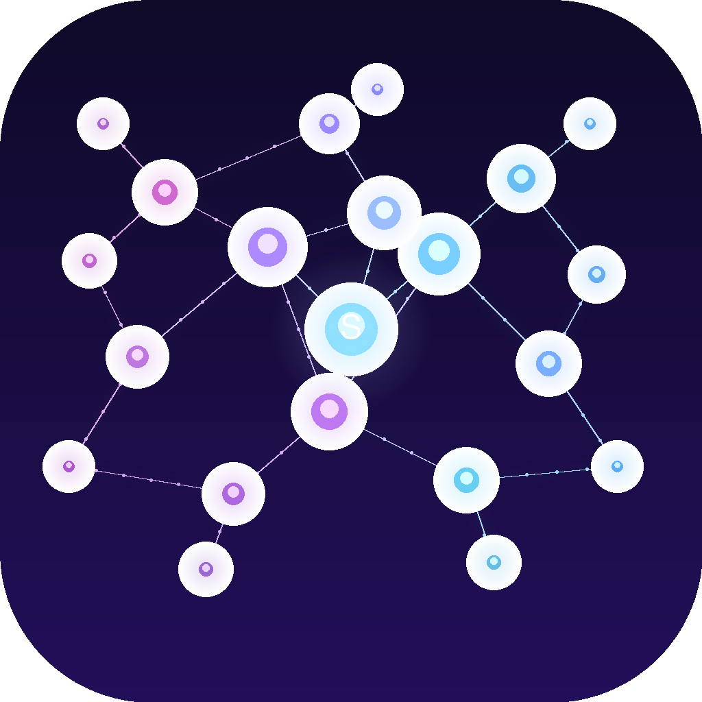
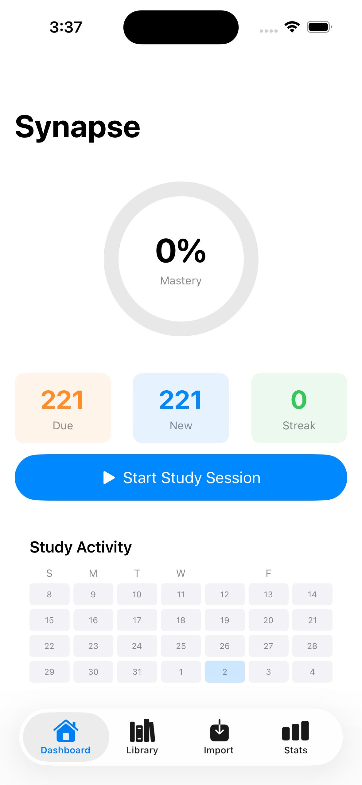
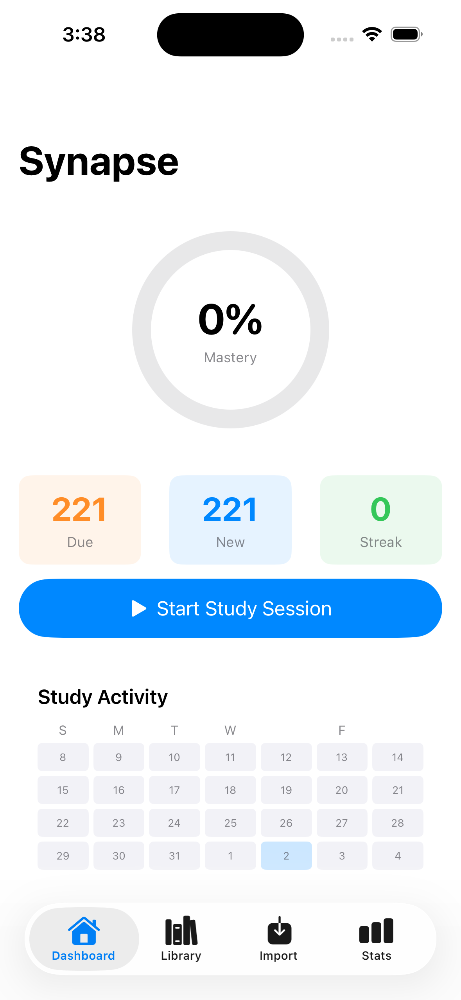
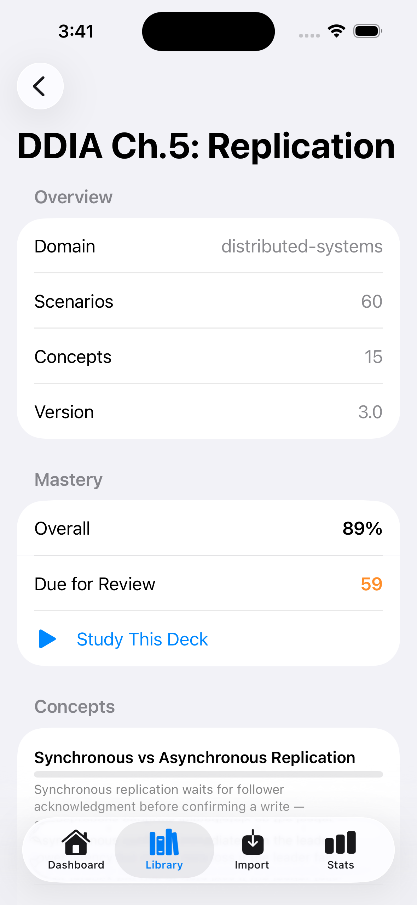
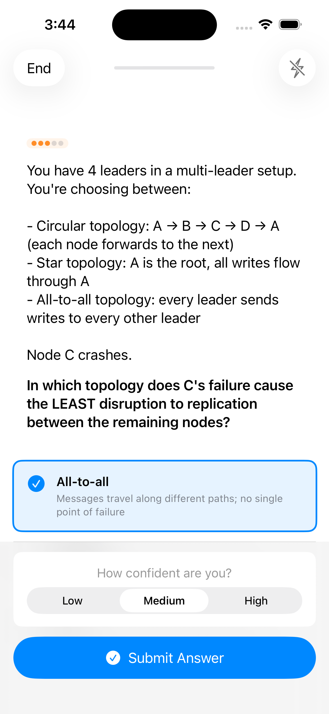
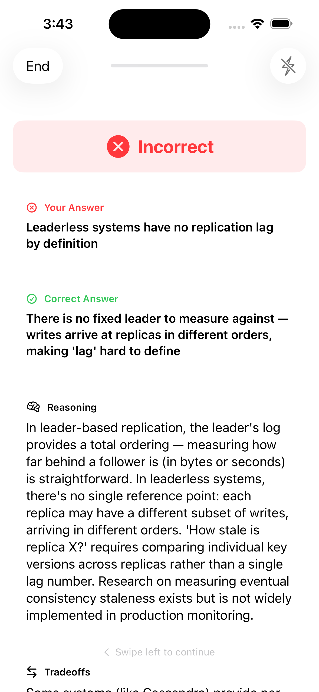

<p align="center">
  
</p>

<h1 align="center">Synapse</h1>

<p align="center">
  <strong>Spaced repetition for decision-making, not just memorization.</strong><br/>
  An iOS app that trains your engineering intuition through scenario-based flashcards with tradeoff analysis.
</p>

<p align="center">
  
  
  
  
</p>

---

## The Problem

Most flashcard apps test recall: *"What is the time complexity of Dijkstra's?"*

That's trivia. It doesn't prepare you for the moment in an interview or a design review when someone asks *"why would you pick X over Y?"* and you need to reason through tradeoffs on the spot.

Synapse trains **judgment** — the kind of intuition you build from years of experience, compressed into a study session.

---

## A Study Session

### 1. Pick a deck and hit study

You open the app. The dashboard shows what's due, your streak, and your overall mastery.

<p align="center">
  
</p>

### 2. Browse your library

Your decks live here. Each one shows scenario count, concept count, and your mastery percentage. Import as many as you want — any topic, any source.

<p align="center">
  
</p>

### 3. Drill into a deck

Tap any deck to see the full breakdown — domain, scenario count, concepts covered, and per-concept mastery bars. Hit "Study This Deck" to focus on just that topic.

<p align="center">
  
</p>

### 4. Face a real decision

No multiple-choice trivia. You get a realistic scenario with context, constraints, and a question that forces you to think about tradeoffs. Pick the option you'd actually choose in practice, then rate your confidence.

<p align="center">
  
</p>

### 5. Learn from the breakdown

Wrong answer? Good — that's where learning happens. You see exactly what you missed, the correct reasoning, the tradeoffs you should've considered, and the common mistake that tripped you up. The spaced repetition engine schedules this card to come back sooner.

<p align="center">
  
</p>

---

## How the Spaced Repetition Works

Synapse uses an **SM-2 variant** tuned for decision-making:

- **Got it right and confident?** Card gets scheduled days or weeks out.
- **Got it right but guessed?** Comes back sooner — you need to solidify the reasoning.
- **Got it wrong?** Back in the queue quickly. The explanation sticks better the second time.
- **Difficulty adapts** — each card tracks how hard it is *for you* specifically, not a global difficulty.

The goal isn't 100% accuracy. It's building the intuition to reason through tradeoffs when it matters.

---

## Turn Anything Into a Deck

Watched a YouTube video on Kafka internals? Read a chapter of DDIA? Finished a section of a Leetcode study guide? Turn it into a Synapse deck in under a minute.

### How it works

1. Copy the prompt below into ChatGPT, Claude, or any LLM
2. Replace `[YOUR TOPIC HERE]` with whatever you want to study — a book chapter, a video summary, a topic you're weak on
3. Paste the JSON output into the Synapse Import tab
4. Start studying

You can feed the LLM a YouTube transcript, a PDF, your own notes — anything. It'll distill the material into scenario-based cards that test whether you actually understood the tradeoffs, not just whether you can parrot definitions.

### The Prompt

````
Create a Synapse study deck about [YOUR TOPIC HERE].

## What Synapse Is
Synapse is a spaced-repetition app that tests engineering judgment through
scenario-based cards. Each card presents a realistic situation, asks the user
to make a decision, then explains the reasoning, tradeoffs, and common mistakes.

## Requirements
- Output a single valid JSON object (no markdown fences, no commentary outside the JSON)
- 15-25 scenarios covering the topic thoroughly
- 3-6 concepts that group the scenarios into themes
- Every scenario must test a DECISION or TRADEOFF, not trivia recall
  - Bad: "What is the time complexity of quicksort?"
  - Good: "Your dataset is nearly sorted. Why is quicksort a poor choice here,
    and what would you use instead?"
- Each scenario has exactly 3 options — one correct, two plausible-but-wrong
- Explanations should teach, not just validate: explain WHY the answer is right,
  what tradeoffs exist, and what mistake people commonly make

## JSON Format

{
  "id": "unique-deck-id",
  "title": "Deck Title",
  "description": "One-line description of what this deck covers",
  "domain": "domain-name",
  "version": "1.0",
  "concepts": [
    {
      "id": "concept-id",
      "name": "Human-Readable Concept Name",
      "description": "What this concept covers"
    }
  ],
  "scenarios": [
    {
      "id": "PREFIX-s01",
      "type": "decision",
      "difficulty": 2,
      "concepts": ["concept-id"],
      "prompt": {
        "context": "A detailed realistic situation. Multiple sentences are fine.\nUse \\n for line breaks if needed.",
        "question": "A specific question that forces a decision."
      },
      "options": [
        {
          "id": "PREFIX-s01-o1",
          "label": "The answer text (can be long — this is what the user reads)",
          "description": "A shorter supporting explanation shown below the label"
        },
        {
          "id": "PREFIX-s01-o2",
          "label": "A plausible but incorrect alternative",
          "description": "Why someone might think this is correct"
        },
        {
          "id": "PREFIX-s01-o3",
          "label": "Another plausible but incorrect alternative",
          "description": "The reasoning behind this wrong choice"
        }
      ],
      "correctOptionId": "PREFIX-s01-o1",
      "explanation": {
        "reasoning": "2-4 sentences explaining WHY the correct answer is right. Be specific.",
        "tradeoffs": "When might the other options actually be valid? What are the tensions?",
        "keyTakeaway": "One sentence the user should remember.",
        "commonMistake": "What do people typically get wrong and why?"
      }
    }
  ]
}

## Critical Rules
1. The "id" field on the deck must be a unique kebab-case string (e.g., "react-hooks-patterns")
2. ALL scenario IDs must be prefixed with a short deck prefix to ensure global uniqueness
   (e.g., for a React deck, use "rh-s01", "rh-s02", etc.)
3. ALL option IDs must follow the pattern: PREFIX-sNN-oN (e.g., "rh-s01-o1", "rh-s01-o2")
4. correctOptionId must exactly match one of the option IDs in that scenario
5. Every concept referenced in a scenario's "concepts" array must exist in the top-level concepts array
6. difficulty is 1 (easy), 2 (medium), or 3 (hard)
7. Do NOT randomize which option is correct — vary it naturally across scenarios
8. Output raw JSON only. No ```json fences. No text before or after.
````

### Example

Here's what a real scenario looks like in the JSON — a card about leaderless replication from a distributed systems deck:

```json
{
  "id": "ch5-s48",
  "type": "decision",
  "difficulty": 2,
  "concepts": ["leaderless"],
  "prompt": {
    "context": "In your Dynamo-style database, after a node outage, the recovered node has stale data for some keys. Two mechanisms exist to bring it up to date:\n\n- Read repair: When a client reads and detects stale data on a replica, it writes the newer value back\n- Anti-entropy process: A background process continuously looks for differences between replicas and copies missing data",
    "question": "What happens to data that is RARELY read if only read repair is used (no anti-entropy)?"
  },
  "options": [
    {
      "id": "ch5-s48-o1",
      "label": "Rarely-read data may remain stale indefinitely, reducing durability",
      "description": "Read repair only triggers when data is actually read; if nobody reads it, it's never repaired"
    },
    {
      "id": "ch5-s48-o2",
      "label": "The data is automatically repaired within a few minutes",
      "description": "Read repair works on all data regardless of read patterns"
    },
    {
      "id": "ch5-s48-o3",
      "label": "The data is lost permanently",
      "description": "Without anti-entropy, stale data is eventually garbage collected"
    }
  ],
  "correctOptionId": "ch5-s48-o1",
  "explanation": {
    "reasoning": "Read repair is only triggered when a client happens to read the data and detects a stale version. For values that are rarely or never read, read repair never kicks in, so some replicas may permanently hold stale data. This reduces effective durability — if the nodes with the current data fail, the stale version is all that remains.",
    "tradeoffs": "Anti-entropy processes solve this by continuously scanning for differences in the background, regardless of read patterns. However, anti-entropy doesn't guarantee ordering and may have significant delay. Using both mechanisms provides the best coverage: read repair for frequently accessed data, anti-entropy for everything else.",
    "keyTakeaway": "Read repair alone leaves rarely-read data vulnerable — it only fires on actual reads. Anti-entropy is needed to ensure ALL data converges.",
    "commonMistake": "Assuming read repair covers all data. It only fixes what gets read. Cold data stays stale forever without anti-entropy."
  }
}
```

### Importing

Two ways to get your deck into Synapse:

1. **Paste JSON** — Go to the Import tab, paste the entire JSON output, tap "Parse & Preview" to validate, then import
2. **Import from File** — Save the JSON as a `.json` file, tap "Import from File", and select it

The app validates everything on import — concept references, option IDs, required fields. If something's wrong, you'll get a specific error message telling you what to fix.

### Ideas for decks

- **Book chapters** — paste a chapter summary or your highlights into the LLM alongside the prompt
- **YouTube videos** — grab the transcript (or just describe the video topic), feed it in
- **Lecture notes** — turn a semester of notes into spaced repetition cards
- **Interview prep** — create targeted decks for system design, behavioral, or coding patterns
- **Work knowledge** — internal architecture decisions, oncall runbooks, team conventions
- **Certification prep** — AWS, Kubernetes, Terraform — anything with decisions and tradeoffs

---

## Architecture

```
Synapse/
├── Models/          SwiftData @Model classes (Deck, Scenario, Option, etc.)
├── DTOs/            Codable structs for JSON import (DeckDTO, ScenarioDTO, DTOMapper)
├── Services/        SpacedRepetitionEngine, DeckImportService, StudySessionManager
├── Views/
│   ├── Dashboard/   Mastery ring, streak calendar, study launcher
│   ├── Library/     Deck list, deck detail, concept mastery
│   ├── Study/       Scenario cards, options, feedback, session complete
│   ├── Import/      JSON paste, file import, preview
│   ├── Stats/       Statistics and progress tracking
│   └── Components/  Reusable UI (tags, badges, progress bars, diagrams)
└── SampleDecks/     Bundled JSON decks
```

**Key design decisions:**
- **Separate DTO layer** from SwiftData models — avoids the Codable + `@Model` headaches
- **DTOMapper** converts imported JSON into the full SwiftData object graph with relationships
- **Offline-first** — no backend, no accounts, no network calls. Your data stays on device.
- **SM-2 variant** with confidence modifiers and per-scenario difficulty tracking

## Building

```bash
git clone <repo-url>
cd Synapse
open Synapse.xcodeproj
# Build & Run (Cmd+R)
```

Requires iOS 17.0+, Xcode 15.0+, Swift 5.9+.

---

<p align="center">
  <sub>Built with SwiftUI + SwiftData. No backend. No telemetry. Just learning.</sub>
</p>
